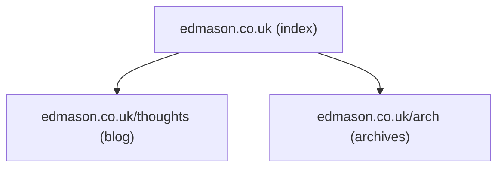

# edmason.co.uk
My website, built with [Astro](astro.build).

## Structure

```mermaid
flowchart TD
A["edmason.co.uk (index)"]
A-->B["edmason.co.uk/thoughts (blog)"]
A-->C["edmason.co.uk/arch (archives)"]
```

## Copyright
&copy; 2025 Ed Mason.
